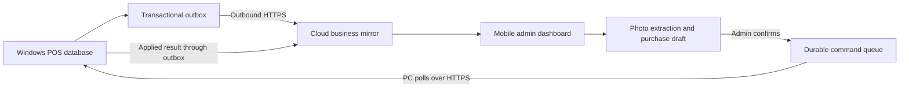

# Mobile admin dashboard and purchase-photo plan

## Agreed scope

The phone web app mirrors all business information from the Windows POS, not just selected reports. The admin can inspect the complete store from anywhere. The PC remains able to sell offline. This is the implementation plan; the mobile app, cloud synchronization, and photo extraction are not implemented yet.

Assume one store and one writing POS initially, English/Arabic, USD/LBP, and the store's reporting timezone. The phone dashboard also supports a new admin-only workflow: photograph a supplier invoice or purchase receipt, review an automatically prepared purchase, and submit it to the PC. Hosting and document recognition providers are still to be selected.

## What is mirrored

| Area | Phone admin dashboard |
| --- | --- |
| Sales and returns | Complete receipt history and lines, cashier, quantities, original currencies/rates, tender, change, discounts, manual pricing, refunds and edits |
| Products | Names, categories, SKUs, primary/additional barcodes, barcode quantities and price overrides, weighted-unit settings, purchase costs and selling prices |
| Stock | Quantities, adjustments, expiration batches, low-stock status and recorded waste |
| Purchasing | Suppliers, purchase orders and lines, quantities, costs, currencies, references, dates and purchase edits |
| Debts | Customer/debt-card names, unpaid and settled sales, payment history and remaining balances |
| Other activity | Personal purchases and the data used for profit calculations |
| Pricing and settings | Offers, price rules, exchange rates, store profile and business configuration |
| Administration | User names/roles/status and relevant audit history, with credentials excluded |
| Reports | All POS reports, totals and filters using the same calculation definitions |
| Sync health | PC status, last successful sync, pending changes and errors |

Inventory every current POS screen and persisted business field before implementation, and map each to its sync contract and phone screen. Future business fields must update that inventory. Historical records, edits, deletions and attachments used by the POS are included, not just today's data. Where the desktop does not retain history, the phone cannot invent it; add explicit events if that history is required.

A full business mirror does not copy password hashes, JWT keys, device credentials, local filesystem paths, printer/serial-port configuration or temporary carts/browser state. Desktop user metadata is informational; web access is granted separately. Business customer/debt data is included and restricted to authorized admins.

Use Overview, Activity, Stock, and More navigation, with purchases and photo capture easy to reach. Support small screens, search/filtering, bilingual layouts and home-screen installation. Display the latest applied PC checkpoint and update time. Cache only the app shell initially.

## Data flow and ownership

The PC is authoritative for committed business records. All its committed changes are mirrored to the cloud. The phone reads that mirror and submits explicit purchase commands; it never writes directly to the PC database or overwrites stock with an old snapshot. No public database port or router port forwarding is needed.

Target updates within 10 seconds while both services are healthy, then measure this in the pilot. While the PC is off or disconnected, the phone shows the latest synchronized snapshot with its age. Purchase drafts can be prepared and submitted, but remain visibly pending until the PC accepts them. With the current app lifecycle, synchronization runs while Aurora POS is open. A later Windows background service can keep it running while the window is closed; no software can synchronize a powered-off PC.

## Reliable synchronization

1. Pair the PC with the admin's store using a short-lived code and a revocable device credential protected by Windows encryption.
2. Upload a consistent initial snapshot of all business entities and history with a checkpoint. Capture changes made during the snapshot so no update is lost.
3. Write an outbox event in the same database transaction as every business mutation, including purchases, sales, returns, stock, debts, settings, users and deletions.
4. Apply batches atomically using store ID, device ID, generation, event ID, sequence and record version. Retry safely and acknowledge only committed events. Preserve dependencies and decimal precision.
5. Track explicit tombstones, backdated edits and schema versions. Reconcile record counts, versions and totals regularly, including records that no longer appear in a default report.
6. A restored backup starts a new generation and reconciles the mirror. Quarantine pending phone commands from the old generation for review rather than silently replaying them into restored stock.
7. Phone commands have stable IDs, expected record versions and explicit states: draft, submitted, waiting for PC, applied, or needs correction. The PC transaction records the command ID, purchase, inventory effects, audit entry and outbox events together. Retrying after a timeout cannot create a second purchase.
8. If a matched product changed or was deleted while a draft waited, return a reviewable conflict. Never silently change the admin's chosen item, cost or quantity.

## Purchase from a photo

### Intended experience

1. The admin taps **New purchase > Take photo**, photographs a supplier invoice/receipt, or uploads one or more pages. Offer crop/rotate, retake and page ordering.
2. Document recognition prepares a draft: supplier, invoice number/date, item names, quantities, units, pack sizes, and any legible costs/currencies. Show the photo alongside extracted lines and highlight uncertain or missing values.
3. Match items to the mirrored catalog using an exact barcode when available, then suggest possible name/SKU matches. The admin chooses ambiguous matches, scans/types missing barcodes, or explicitly creates a new product. Never invent a barcode or automatically merge similar products.
4. The admin enters or confirms purchase cost and currency for every line, and selling price when needed. Existing selling prices remain unless explicitly changed. Allow edits to quantities, units and all extracted fields; show pack conversion clearly, such as 3 boxes × 12 units = 36 units. Weighted items retain decimal quantities.
5. Show the supplier, items, totals, exchange rate and expected stock increase in a final preview. Check invoice totals/discounts/taxes where present; unexplained differences require correction or an explicitly recorded adjustment supported by the purchasing model.
6. **Confirm purchase** submits one durable command. The PC validates it through the purchasing domain logic, creates the purchase and stock effects atomically, and returns the saved purchase ID. The phone displays **Recorded in POS** only after acknowledgement and mirror reconciliation.

Recognition automates data entry into a draft. Stock and costs change only after admin confirmation and PC acceptance. An invoice photo is preferable: a picture of the goods alone cannot reliably establish quantity, cost, supplier or barcodes. Goods photos may help suggest product names, but those fields still need manual confirmation. Always provide a fully manual entry path.

### Implementation details

- Add cloud draft/document storage and an admin-only extraction endpoint. Keep document parsing server-side with structured output validation; treat extracted text as data, never as executable instructions.
- Extend the existing CreatePurchaseRequest flow (supplier, reference, date, exchange rate, ProductId/barcode, name, SKU, category, quantity, unit cost, currency and selling price) with command IDs, versions and source-document references. Verify pack conversions, fractional limits, tax/discount support and consistent USD/LBP rounding before introducing fields the PC cannot preserve.
- Warn about duplicate supplier/invoice references and repeated document hashes. Require an explicit override for a legitimate duplicate; network retries always reuse the same command ID.
- Use exact product IDs once the admin confirms a match. Creating a product and posting the associated purchase must succeed together or leave a clear actionable failure.
- Limit file size/type/page count; strip location metadata, authorize every document request per store, use short-lived image URLs and define retention/deletion. Audit the uploader, reviewer, edits and applied result.
- Benchmark Arabic/English invoices, handwriting, glare, torn pages, decimal separators, multi-page receipts and mixed currencies before choosing a provider. Measure extraction quality and per-document costs; do not assume perfect recognition.

## Security and correctness

Use a separate web admin identity with MFA, recovery and revocable sessions. Enforce admin role and store membership on every read, document, draft and command endpoint. Use HTTPS, secure HTTP-only sessions, CSRF protection where applicable, encrypted storage/backups and audit logs. No secret from the PC is exposed to the phone.

Preserve original amounts, exchange rates, timestamps and reporting timezone. Share tested reporting definitions so the dashboard agrees with the POS for refunds, debts, personal purchases, waste and manual prices. Owner-only remote purchase entry is in scope; other remote edits require explicit workflows and conflict rules before enabling them.

## Delivery stages

1. Inventory all business data/screens and define synchronization contracts, permissions and parity checks.
2. Implement pairing, the full snapshot, transactional outbox, cloud ingestion, retries, deletion/restore reconciliation and visible sync status.
3. Build the complete mobile admin mirror with search, filters, Arabic/English and reports matching the PC.
4. Implement manual mobile purchase drafts and the reliable command/acknowledgement path before adding recognition.
5. Add camera/upload, extraction, catalog suggestions and the review/confirmation experience.
6. Pilot with realistic store data and real invoices; choose hosting/domain, recovery/retention policies and recognition provider, then release a signed desktop sync update and the web app.

## Acceptance checks

- Every mapped business entity/field matches after initial sync, edits, deletion, reconnect and backup restore; totals alone are insufficient.
- Sales continue offline; crashes and retries do not lose or duplicate business events.
- An admin sees complete history and accurate stale/offline/pending labels on the phone.
- An eight-hour outage queues updates safely; reconnect catches up without overwriting newer stock.
- Photo drafts never change stock before confirmation. Missing prices, ambiguous items and invalid quantities cannot post silently.
- Double taps, cloud timeouts, PC crashes and command redelivery create at most one purchase and one set of inventory effects.
- A PC restore or changed/deleted product produces an explicit command conflict rather than an incorrect purchase.
- Two stores cannot access each other's records, documents or commands. Non-admin users cannot submit purchases.
- Compare photo-assisted and manually entered purchases for identical final quantities, costs, totals and reports, including Arabic, mixed currencies, weighted items and multi-page invoices.

Remaining implementation choices: hosting and recognition provider, document retention period, additional manager accounts, and whether synchronization must run while the POS window is closed. Full business mirroring and admin-reviewed purchase photos are now requirements.

## Local implementation status

A working first implementation is now available. See [local setup, implemented features, tests and remaining release work](mobile-local-development.md). This includes the full business-table mirror, responsive admin dashboard and admin-confirmed photo-assisted purchase flow. It is a local development build; the production requirements above remain the target. OCR currently suggests lines from locally recognized text and still requires quantity review, price entry and barcode/product matching.
